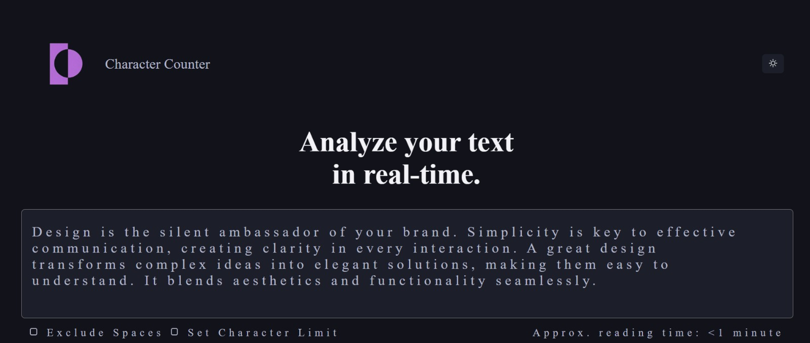
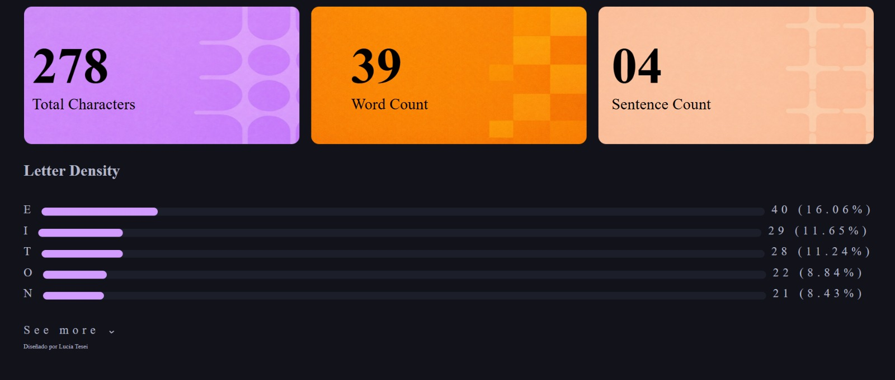

# Character Counter
Proyecto de maquetado web

## Descripción:
Este proyecto es un trabajo practico desarrollado para la materia Frontend. Consiste en replicar una interfaz moderna de un contador de caracteres en tiempo real. 

## Objetivo:
Practicar:
- Maquetado web con HTML
- Flexbox
- Estilos avanzados con CSS
- Organización de componentes visuales
- Estructurar el contenido de forma clara y accesible

## Tecnologias utilizadas:
- HTML
- CSS
- Git
- GitHub
- Microsoft Copilot
- remove.bg

## Estructura del proyecto:
```text
mi-proyecto/
text
└──index.html      #estructura principal de la página
└──css/
|    └──style.css  #estilos visuales del proyecto
└──readme.md       #documentación del proyecto

index.html
└──section       
     └──header          |
     └──h1              |HERO
     └──div             |
└──section
     └──div             |
         └──label       |
         └──label       |CHECKBOX
     └──div             |
         └──label       |
└──section
     └──div             |
         └──img         |
         └──p           |
     └──div             |
         └──img         |METRICAS EN IMAGEN
         └──p           |
     └──div             |
         └──img         |
         └──p           |
└──section
     └──h3
     └──label           |
         └──progress    |
     └──label           |
         └──progress    |
     └──label           |
         └──progress    | BARRAS PROGRESO
     └──label           |
         └──progress    |
     └──label           |
         └──progress    |
     └──label            
         └──select      | SELECTOR
Agregue varias <section> para dividir los distintos elementos, ya que cada parte es importante, desde el header, hasta el progreso de la tarea. Luego, utilice <div> dentro de algunas secciones para dividir elementos y poder estilarlos según la imagen de referencia. Y tambien use varios <label> para poder agregar texto descriptivo en las barras de progreso y en el contador de tiempo.
```
## Resolución de CSS:
Primeramente utilice una propiedad para establecer variables en cuanto a los colores.
Al body le establecí un color de fondo, los margenes y el espaciado interno.
En el header establecí, un contenedor flexible para alinear el logo, el texto y el botón. También distribuí los elementos con "justify-content: space-between", para que tanto el logo y el texto quedaran hacia la izquierda y el botón hacia la derecha. 
El divisor principal, también lo convertimos en contenedor flexible, para alinear cada item y agregarles un espaciado entre ellos (gap). A la imagen y parrafo que tenia, le agregamos las propiedades de "flex-direction: row" para colocarlos en una fila horizontal, "dislay:inline" para que solo ocupen el lugar necesario, y un "top: auto" para posicionarlos en la parte alta de la página.
Al botón del sol, se le aplicaron estilos para eliminar bordes, ponerle fondo, y agregue un "hover" para efecto al pasar el ratón, el cual cambia el color de fondo del mismo.

####importante:
Al textarea le establecí propiedades para estilarlo: darle color, cambiar el borde, ponerle un alto y ancho determinados, en este caso tambien agregue un resize: none para que no se pueda modificar el textarea, propiedad que se va a eliminar en la segunda etapa.

Dentro del contenedor del textarea tambien hay un label, el cual contiene el texto del textarea. Este tomo una posicion absoluta para posicionarse dentro del textarea.
Para los checkbox establecí un contenedor flexible para alinear los elementos horizontalmente, los checkbox del lado izquierdo y el texto con Approx. del lado izquierdo. Tambien se estilaron los selectores de los chackbox, saque apariencia, para darle una nueva, con distinto fondo, y bordes. 
En la parte de metrics, estableci contenedor flexible para poder alinear horizontalmente las imagenes y posicion absoluta en los parrafos para poder adentrarlos en las imagenes, y para centrarlos en las mismas, utilizamos "transform: translate".
En la seccion de progreso, estile las barras de progreso, con un ancho y alto establecidos, redondeamos los bordes, y estebleci un "overflow:hidden" para que respete las dimensiones de su contenedor. 
Por ultimo, para el select estableci otras propiedades para su estilo, sin bordes, fondo como el fondo principal de la pagina, y color de borde como el texto secundario. 


## Dificultades encontradas:
Varias dificultades, entre ellas que me quedó como una página completa y no como una sección. Faltó agregarle una sección más, pero hacer eso me complicaba para estilar luego.
## Resultado final:

